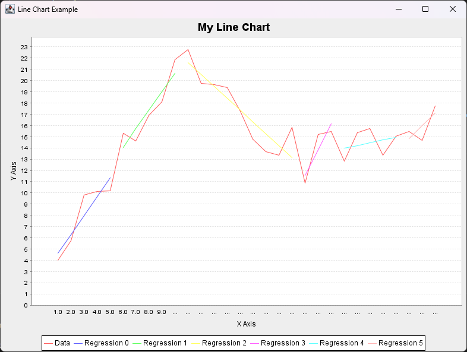
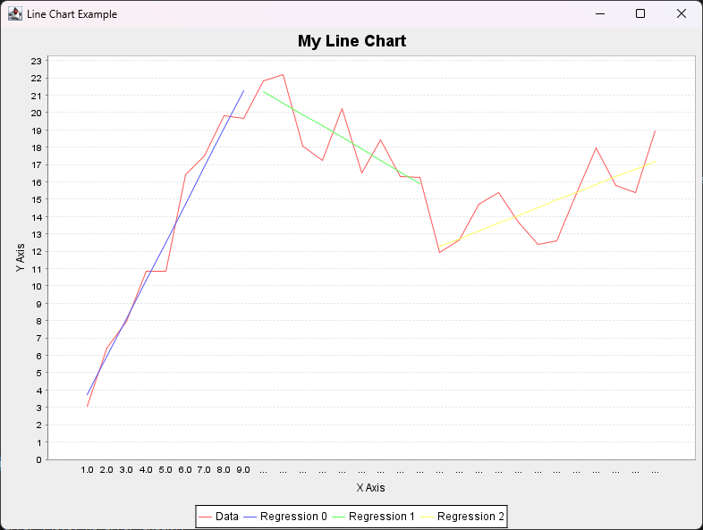

# segreg

## 자바로 변환한 세그먼티드 회귀 분석기
* 참조 코드: https://www.codeproject.com/articles/Segmented-Linear-Regression#comments-section
* 실행 결과: 

    1. error로 filtering된 세그먼트들 

    

    2. 최대 세그먼트 개수로 filtering된 세그먼트들 

    

* 사용 라이브러리
    - Apache Commons Math3
    - JFreeChart

## 중요 파일
* segreg/src/main/java/com/segreg/SegmentedRegression.java: 세그먼티드 회귀 분석기 구현
* segreg/src/main/java/com/segreg/Main.java: 테스트용 실행 파일
* segreg/src/main/java/com/segreg/Segment.java: 세그먼트 클래스 (잘려진 구간을 나타냄)
* segreg/src/main/java/com/segreg/DataPoint.java: 데이터 포인트 클래스 (x, y 좌표를 나타냄)

## 실행 방법
* command line에서 max segments와  max error 값을 인자로 받는다. 이때 음수 값은 해당 필터를 사용하지 않는 것이며 양수값은 해당 값을 넘지 않게 필터링된다.

## 중요 함수
* SegmentedRegression segReg = new SegmentedRegression(x_data, y_data);
    * 데이터를 입력받아 세그먼티드 회귀 분석기 객체를 생성한다. 이때 x_data와 y_data는 double 배열이다.
* segReg.sortData();
    * 입력된 데이터를 x 좌표 기준으로 정렬한다.
* Deque<Segment> segments = segReg.performRegression(maxSegments, maxError);
    * 세그먼티드 회귀 분석을 수행한다. maxSegments는 최대 세그먼트 개수, maxError는 세그먼트별 최대 허용 오차이다. 반환값은 세그먼트들의 덱(Deque)이다.
    * 반환값인 segment는 Segment 클래스 객체로, 각 세그먼트의 시작 인덱스, 끝 인덱스, 회귀 분석 결과를 포함한다.
        * 회귀 분석 결과는 SimpleRegression regression = seg.regression; 형태로 접근할 수 있다.
        * main.java에서 57번째 줄의 regression.predict(sorted_x[i]) 형태로 예측값을 얻는 예시를 참고할 수 있다.

## 관련 함수
* 단순 선형 회귀(simple linear regression, SLR)
    * 독립 변수가 단 한개일 때 연속형 변수들에 대해 독립 변수와 종속 변수 사이의 상관관계를 나타내는 것
    * 회귀 직선: $ y = a + b*x$
        * y: 종속 변수
        * x: 독립 변수
        * a: y절편 (intercept)
        * b: 기울기 (slope)

    * 단순 선형 회귀는 실제 관측값 $y_i$과 $a+b*x_i$에 대한 오차가 적게 되는 $a,b$를 찾는 것을 목표로 한다.
        $$ (\hat{a}, \hat{b}) = \arg\min(Q(a,b)) $$
        $$ Q(a,b) = \sum_{i=1}^n (y_i - a - bx_i)^2 $$

    * Apache Commons Math3 라이브러리의 SimpleRegression 클래스를 사용하여 단순 선형 회귀 분석 객체를 생성한다.

